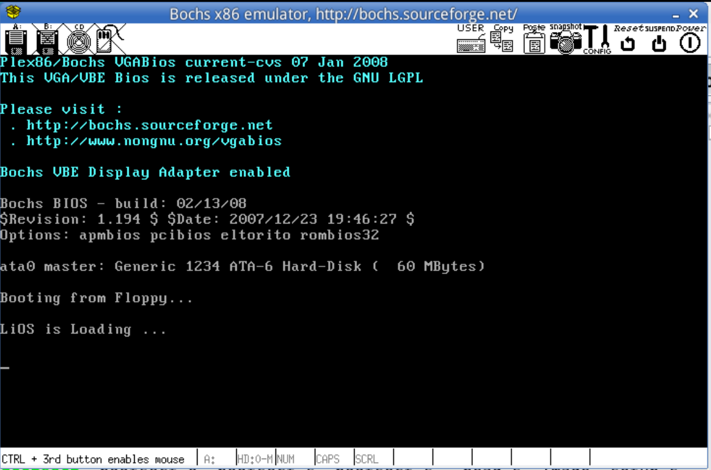
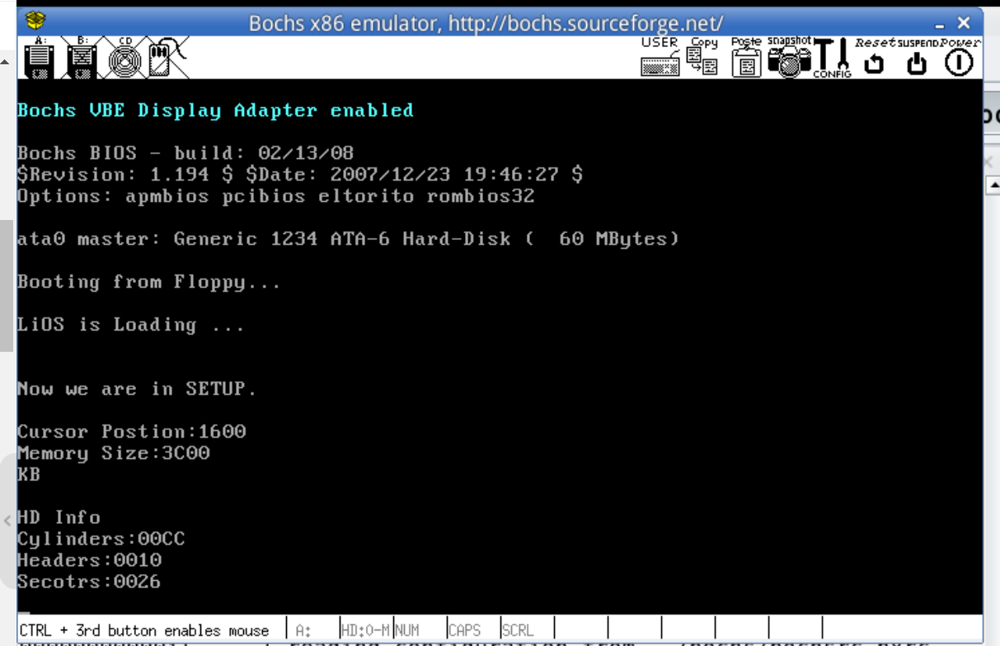

### Lab 1 控制系统启动
- 1.1 阅读《Linux内核完全注释》的第六章（应该是第三章 内核引导启动程序）
- 1.2 按照要求改写0.11的引导程序bootsect.s
  要求屏幕上打印一段提示信息 "XXX is booting..."
- 1.3 (改写进入保护模式前的设置程序setup.s)
  - bootsect.s能完成setup.s的载入，并跳转到setup.s开始地址执行。setup.s向屏幕输出一行"Now we are in SETUP"
  - setup.s能获取至少一个基本硬件参数，将其存放在内存的特定地址并输出到屏幕上
  - setup.s不再加载Linux内核，保持上述信息显示在屏幕上即可

回答问题：
有时，继承传统意味着别手蹩脚。x86 计算机为了向下兼容，导致启动过程比较复杂。请找出 x86 计算机启动过程中，被硬件强制，软件必须遵守的两个“多此一举”的步骤（多找几个也无妨），说说它们为什么多此一举，并设计更简洁的替代方案。

相关文件
boot/bootsect.s, boot/setup.s, tools/build.c

#### 1.2 改写bootsect.s
bootsect.s中截取92行部分代码如下，这是本次实验需要修改的部分
```asm

! Print some inane message

	mov	ah,#0x03		! read cursor pos
	xor	bh,bh
	int	0x10        !0x10中断是BIOS中与屏幕显示器相关的中断（见注释2）
	
	mov	cx,#24        !共24个字符
	mov	bx,#0x0007		! page 0, attribute 7 (normal)
	mov	bp,#msg1
	mov	ax,#0x1301		! write string, move cursor
	int	0x10

......

msg1:
	.byte 13,10
	.ascii "Loading system ..."
	.byte 13,10,13,10

```
因此只需要修改cx的值，#msg1的内容即可  
需要注意，.byte中的10和13分别是换行符和回车符，也要计算在字符串长度内  

在修改完bootsect.s后，执行编译命令（见注释1）
\$ as86 -0 -a -o bootsect.o bootsect.s
\$ ld86 -0 -s -o bootsect bootsect.o

根据实验手册，编译链接后生成的bootsect文件长度为544，超过了一个扇区512字节的限制  
删去Minix可执行文件的头部即可  
\$ dd bs=1 if=bootsect of=Image skip=32 
好了，将生成的Image拷贝到linux-0.11/目录下执行run脚本即可  

实验结果如下



#### 1.3 改写setup.s
在载入setup.s执行时输出一行字符串，在setup.s文件的开头加入即可
```asm
entry start
start:
!在这里加入字符串输出的代码，仿照上个实验即可
  mov ax,#SETUPSEG
  mov es,ax

  mov	ah,#0x03		! read cursor pos
	xor	bh,bh
	int	0x10
	
	mov	cx,#26
	mov	bx,#0x0007		! page 0, attribute 7 (normal)
	mov	bp,#msg2
	mov	ax,#0x1301		! write string, move cursor
	int	0x10
!添加结束，还需在setup.s末尾补上msg2的定义

! ok, the read went well so we get current cursor position and save it for
! posterity.

	mov	ax,#INITSEG	! this is done in bootsect already, but...
	mov	ds,ax
	mov	ah,#0x03	! read cursor pos
	xor	bh,bh
	int	0x10		! save it in known place, con_init fetches
	mov	[0],dx		! it from 0x90000.
```

这一步修改完成后参考实验指导的6.6节修改build.c中的内容以完成编译  
执行  make BootImage 命令

原来的setup.s中已完成对硬件参数的读取，剩下的工作就是将它们显示在屏幕上

继续修改setup.s
在此之前先学习实验指导中给出的print_hex等打印函数  
删去setup.s中多余的部分，将需要的参数打印在屏幕上即可
实验结果如下



修改后的最终文件均放在本文件夹下[bootsect.s](./bootsect.s)和[setup.s](./setup.s)


### 总结
Linux 0.11的启动过程由bootsect.s和setup.s引导
当PC的电源打开时，CPU自动进入实模式，从地址0xFFFF0开始执行程序代码，这个地址通常是ROM-BIOS中的地址  
PC机的BIOS将执行某些系统检测，并在物理地址0处开始初始化中断向量，此后，将启动设备的第一个扇区（系统引导扇区 512字节）读入内存0x7c00处，并跳转到这里开始执行bootsect.s
当bootsect.s执行时，它会将自己移动到0x90000并将setup.s移动到0x90200处，内核中的其他部分读入0x10000
随后由setup.s执行并将系统移动到0地址处。

在本次实验中主要是了解了Linux 0.11启动的引导过程，以及读入的程序在系统内存中位置的变化
完成的功能包括
- 在系统启动页面（bootsect.s运行过程中）输出系统引导内容
- 在系统启动页面（setup.s运行过程中）读取内存，硬盘等硬件参数输出到屏幕上

### 注释
#### 1.as86和ld86
在Linux 0.x系统中使用了两种汇编器，一种是能产生16位代码的as86汇编器，使用配套的ld86连接器。另一种是GNU的汇编器gas  
Linux系统仅用as86和ld86创建16位的启动引导扇区  
汇编的基本格式为
```
as [选项] -o objfile srcfile
```
-0 以16位代码段运行
-a 使汇编程序部分兼容于Minix
-o 生成目标文件（目标文件名写在后面）

注：Ubuntu 18.04缺少相应环境 参考https://blog.csdn.net/qq_40758751/article/details/88707214 解决

#### 2.中断类型
int 0x10中断是BIOS中与屏幕显示器相关的中断，根据寄存器ah中的值确定调用的功能  
详细用法参见 [0x10中断的各种功能以及参数](https://blog.csdn.net/qq_40169767/article/details/101511805)  
在本实验涉及部分有两次  
①ah为3,功能为读光标位置（同时调用bh作为参数，bh为页号）  
②ax为0x1301，即ah为13，功能为显示字符串（es:bp为串地址，cx为串长度）


#### 3.寄存器
cs寄存器 Code Segment 通常和IP寄存器一起使用 CS:IP(基地址：偏移地址)  
ds寄存器 Data Segment 通常用于存放数据
ss寄存器 Stack Segment 一般作为栈使用，和sp寄存器一起 SS:SP(栈首地址：偏移地址)   
es寄存器 Extra Segment 扩展段寄存器 

在完成实验1.3的过程中注意到,start开始时需要设置es寄存器的值为SETUPSEG