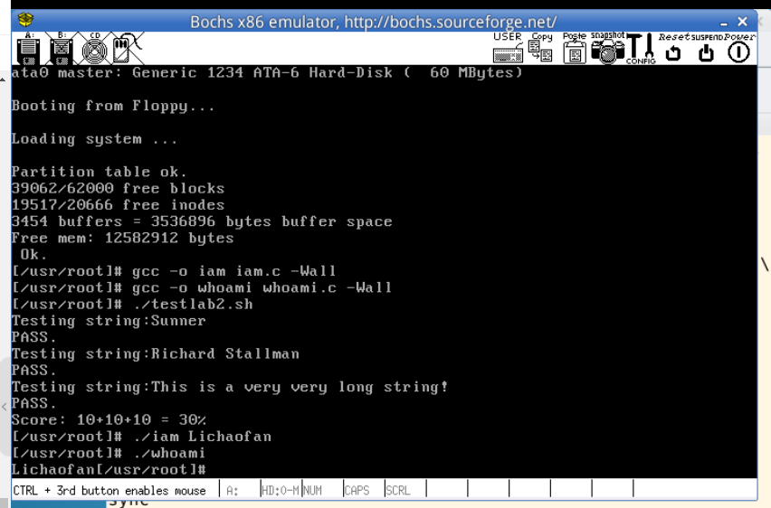

### Lab 2 系统调用
在Linux 0.11上添加两个系统调用
- iam()
    函数原型int iam(const char * name)  
    将name中的内容拷贝到操作系统内核中并保存下来，要求name的长度不超过23个字符，返回值是拷贝的字符数。如果name的长度超过了23个字符，则返回-1，并置errno为EINVAL  
    在kernel/who.c中实现
- whoami()
    int whoami(const char * name, unsigned int size)
    它将内核中由iam()保存的名字拷贝到name所指的用户空间中，同时确保不会对name越界访问（name的大小由size说明）。返回值是拷贝的字符数，如果size小于所需空间，则返回-1，并置errno为EINVAL
    在kernel/who.c中实现

#### 2.1 who.c的编写
首先按照实验要求在/kernel/who.c中完成iam()和whoami()系统调用的实现
```c
int sys_iam(const char* name){
    int i;
    char tmp[25];
    for(int i=0;i<25;i++){
        tmp[i]=get_fs_byte(name+i); //get_fs_byte()见注释2
        if(tmp[i]=='\0') break;
    }

    i=0;
    while(i<25&&tmp[i]!='\0')   i++;
    if(i>23)    return -(EINVAL)
    strcpy(msg,tmp);
    return i;
}
```
同理，完成whoami()函数，具体实现见who.c

#### 2.2 新增系统调用的配置
完成后需要在sys_call_table中增加这两个调用，否则系统不能识别该调用  
在./include/unistd.h和./include/linux/sys.h文件中对系统调用的定义进行增加  
以及在kernel/system_call.s中修改系统调用的数量
```c
// ./include/unistd.h
......
#define __NR_iam    72
#define __NR_whoami 73

// ./include/linux/sys.h
......
extern int sys_iam();
extern int sys_whoami();

fn_ptr sys_call_table[]={......,
sys_iam,sys_whoami};

// ./kernel/system_call.s
// 61行
nr_system_calls=74
```

在完成以上文件修改后，最后修改kernel/Makefile文件以将kernel/who.c和其他文件链接在一起
```Makefile
# 27行
OBJS  = sched.o system_call.o traps.o asm.o fork.o \
	panic.o printk.o vsprintf.o sys.o exit.o \
	signal.o mktime.o who.c
# 50行
### Dependencies
who.s who.o: who.c ../include/linux/kernel.h ../include/unistd.h
......
```

#### 2.3 验证系统调用函数的编写
为验证我们已经增加的系统调用，需要编写两个用户程序调用这两个系统调用  
主要内容如下，具体实现见iam.c和whoami.c
```c
//iam.c
_syscall1(int, iam, const char*, name);

int main(int argc,char ** argv)
{
	iam(argv[1]);   //直接调用iam()并将用户输入的字符串传递给iam()
	return 0;
}

//whoami.c
_syscall2(int, whoami,char*,name,unsigned int,size);

int main()
{
	char s[30];
	whoami(s,30);
	printf("%s",s);
	return 0;
}
```

#### 2.4 最终实现
按照实验指导将img文件挂在到hdc文件夹下  
将 iam.c whoami.c testlab2.sh 复制到 hdc/usr/root 目录下  
修改 include/unistd.h 文件中的系统调用编号，这里的这个文件和我们之前修改的 linux 0.11/include/unistd.h 文件相似，但是还是要改一下  
至于原因，实验指导没有细讲，不太清楚  

在linux 0.11 目录下执行 make all
在oslab目录下执行 ./run 进入虚拟机中

编译链接iam.c和whoami.c  
```
gcc -o iam iam.c -Wall
gcc -o whoami whoami.c -Wall
```
执行 ./testlab2.sh得到最终实验结果  

  

### 注释
#### 1.系统调用的过程
系统调用的过程
- 将系统调用的编号存入eax中
- 把函数参数存入其他通用寄存器
- 触发0x80中断

```c
# close的调用过程
int close(int fd)
{
    long __res;
    __asm__ volatile ("int $0x80"
        : "=a" (__res)
        : "0" (__NR_close),"b" ((long)(fd)));
    if (__res >= 0)
        return (int) __res;
    errno = -__res;
    return -1;
}
```
它先将宏 __NR_close 存入 EAX，将参数 fd 存入 EBX，然后进行 0x80 中断调用。调用返回后，从 EAX 取出返回值，存入 __res，再通过对 __res 的判断决定传给 API 的调用者什么样的返回值。  
传递更多参数时就需要用到ecx和edx寄存器了

#### 2.在内核空间和用户空间之间传递字符串
如何在内核态和用户态之间传递字符串指针呢  
参考open调用的实现以及实验指导6.7可以得知，有如下两个函数
```c
get_fs_byte(char *) //内核态程序通过指针读取用户态的字符串
put_fs_byte(char *) //用户态程序通过指针读取内核态的字符串
```

#### 3.Linux 0.11保存文件的问题
在Linux 0.11下用vi编辑文件后:wq无法保存，只好在Ubuntu下用vim编辑了


#### 4.编译链接都没有报错，但运行没反应？
记得修改system_call.s中的总调用数，不然就会出现这个现象