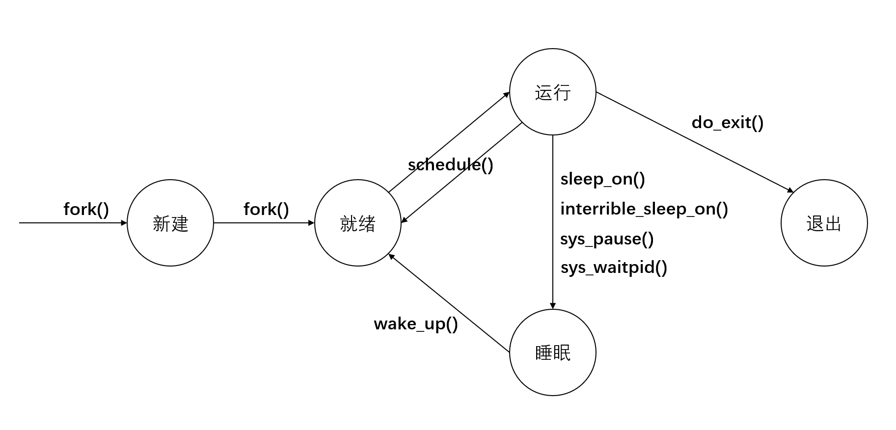
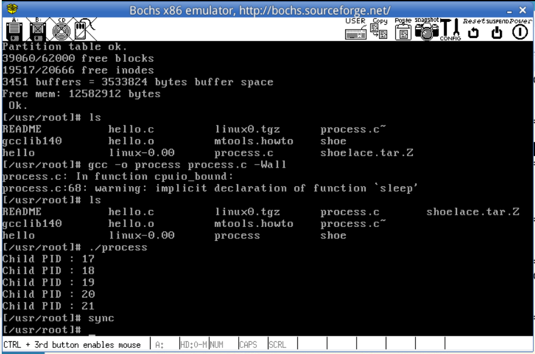
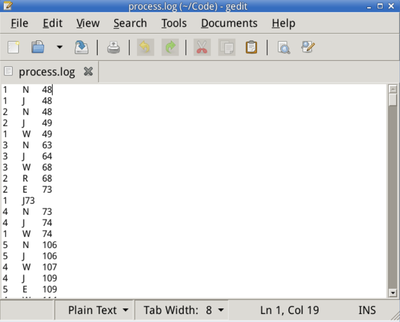

### Lab 3 进程运行轨迹的跟踪与统计
- 基于模板process.c编写多进程的样本程序，实现如下功能
  - 所有子进程都并行运行，每个子进程的实际运行时间一般不超过30秒
  - 父进程向标准输出打印所有子进程的id，并在所有子进程都退出后才退出

- 在Linux 0.11上实现进程运行轨迹的跟踪
  - 基本任务是在内核中维护一个日志文件/var/process.log，把从操作系统启动到系统关机过程中的所有进程的运行轨迹都记录在log文件中
  - 在修改过的0.11上运行页样本程序，通过分析log文件，统计该程序建立的所有进程的等待时间、完成时间（周转时间）和运行时间，也可以使用python脚本 stat_log.py （在\home\teacher\目录下）进行统计
  - 修改0.11进程调度的时间片，再运行同样的样本程序，体会不同时间片带来的差异

相关文件  
init/main.c kernel/fork.c kernel/sched.c

进程状态切换点
kernel/fork.c,sched.c,exit.c

#### 3.1 process.c文件的编写
先来看给出的帮助函数void cpuio_bound(int last,int cpu_time,int io_time)
```c
// 此程序模拟了占用CPU的实际和I/O时间
void cpuio_bound(int last, int cpu_time, int io_time)
{
	struct tms start_time, current_time;
	clock_t utime, stime;
	int sleep_time;

	while (last > 0)
	{
		/* CPU Burst */
		times(&start_time);
		/* 其实只有t.tms_utime才是真正的CPU时间。但我们是在模拟一个
		 * 只在用户状态运行的CPU大户，就像“for(;;);”。所以把t.tms_stime
		 * 加上很合理。*/
		do
		{
			times(&current_time);
			utime = current_time.tms_utime - start_time.tms_utime;
			stime = current_time.tms_stime - start_time.tms_stime;
		} while ( ( (utime + stime) / HZ )  < cpu_time );
		last -= cpu_time;

		if (last <= 0 )
			break;

		/* IO Burst */
		/* 用sleep(1)模拟1秒钟的I/O操作 */
		sleep_time=0;
		while (sleep_time < io_time)
		{
			sleep(1);
			sleep_time++;
		}
		last -= sleep_time;
	}
}
```
在上述程序基础上编写Ubuntu下的测试程序 ./lab3/process.c


// process.log出了点问题，0进程一直打印  
// sys_pause函数中加上一条判断，不再输出进程0的循环等待信息

//调度时间片修改在p->priority上

// process.log为输出的日志文件

// Linux 0.11上的gcc好像不支持双斜线注释


#### 3.2 修改Linux 0.11源码实现进程轨迹跟踪
按照顺序修改Linux 0.11内核代码
首先按照实验手册6.2指导，为在内核启动时就打开log文件开始记录，直接在进程0中就增加log文件的打开以及文件描述符的绑定
（ps. 进程0是系统初始化的一部分，在系统启动时创建，负责初始化各种数据结构和资源，随后切换到第一个用户进程；进程1是用户级别的初始化进程，通常是init，负责初始化用户空间，加载配置文件等，进程1是所有其他进程的父进程；进程2是系统的第一个用户进程，通常为bin/init，是用户级别的shell进程；所以为了更早开始记录进程信息，本实验选择在进程0后开始跟踪）
```c
//在 init/main.c中增加如下部分

move_to_user_mode();
/********修改部分********/
setup((void *) &drive_info);	//加载文件系统
(void) open("/dev/tty0",O_RDWR,0);	//打开tty0(见注释2)，将tty0和文件描述符0关联
(void) dup(0);	// 将文件描述符1和/dev/tty0关联（见注释3）
(void) dup(0);

(void) open("./var/process.log",O_CREAT|O_TRUNC|O_WRONLY,0666);
/********修改结束********/

// 这一部分是从init()中的对应部分移植过来的，因此删除init中的对应部分
```

在内核状态下，无法使用write()函数，正如printf()和printk()之间的区别。这里6.3中直接给出了fprintk()函数作为参考，这一函数参考了printk()和sys_write()。

Q:printf()和printk()的什么区别导致了使用场景不同？(见注释5)

参考实验手册给出的fprintk()函数，将其放入kernel/printk.c中

在kernel/sched.c中
```c
long volatile jiffies=0; //全局变量，记录从开机到现在时钟中断发生的次数
...
//在sched_init()函数中，定义了中断号0x20以及中断处理函数timer_interrupt
set_intr_gate(0x20,&timer_interrupt);
//到kernel/system_call.s中可找到timer_interrupt的实现
//其中 incl jiffies 就是在增加该全局变量的值
```
在kernel/sched.c中
```c
outb_p(0x36,0x43);		/* binary, mode 3, LSB/MSB, ch 0 */
outb_p(LATCH & 0xff , 0x40);	/* LSB */
outb(LATCH >> 8 , 0x40);	/* MSB */
//LATCH即为时钟频率
```

在准备好process.log记录以及了解完时钟中断后，开始在进程状态切换处增加log输出语句
首先，根据进程状态转换关系可得

涉及到的文件如下
> ./kernel/fork.c/copy_process
./kernel/exit.c/do_exit,sys_waitpid
./kernel/sched.c/schedule,sleep_on,interruptible_sleep_on,sys_pause,wake_up

在每个状态改变处加入 fprintk(3,"%d\tStatus\t%d\n",p->pid,jiffies); 即可，详见本目录下相关文件


#### 3.3 最终实现
1.将写好的process.c文件在ubuntu下编译链接并运行，验证正确性，然后拷贝到Linux 0.11的img中
注意：Linux 0.11和Ubuntu的环境有区别，不能用双斜线注释，且wait()函数必须带参数
2.添加kernel/fprintk()
3.修改init/main.c，增加日志文件
4.在进程状态转换处增加日志输出,实验的Linux 0.11输出如下，共运行了5个进程

查看日志可以分析处进程的运行情况

与先前的分析一致，先是最开始用于初始化的进程1创建并就绪，随后是shell进程2，进程1进入等待，创建进程3并就绪，进程1和3均让出CPU，进程2进入执行态......
5.修改时间片
由读代码过程可知，Linux 0.11的调度算法是选counter值最大的就绪进程进行调度，运行态的进程counter会随时钟中断不断减少，是一种时间片轮转的算法。时间片的定义在./include/linux/sched.h
```c
#define INIT_TASK \
/* state etc */	{ 0,15,15, \   /*这里的后两项就是counter和priority的值*/
/* signals */	0,{{},},0, \
/* ec,brk... */	0,0,0,0,0,0, \
/* pid etc.. */	0,-1,0,0,0, \
/* uid etc */	0,0,0,0,0,0, \
/* alarm */	0,0,0,0,0,0, \
/* math */	0, \
/* fs info */	-1,0022,NULL,NULL,NULL,0, \
/* filp */	{NULL,}, \
	{ \
		{0,0}, \
/* ldt */	{0x9f,0xc0fa00}, \
		{0x9f,0xc0f200}, \
	}, \
/*tss*/	{0,PAGE_SIZE+(long)&init_task,0x10,0,0,0,0,(long)&pg_dir,\
	 0,0,0,0,0,0,0,0, \
	 0,0,0x17,0x17,0x17,0x17,0x17,0x17, \
	 _LDT(0),0x80000000, \
		{} \
	}, \
}
```

### 注释
#### 1. tms结构体
```c
struct tms{
	clock_t tms_utime;//用户CPU时间    这里的clock_t类型是long int
 	clock_t tms_stime;//系统CPU时间
    clock_t tms_cutime;//终止的子进程，用户CPU时间
    clock_t tms_cstime;//终止的子进程，系统CPU时间
  };
```

#### 2. /dev/tty0
Linux系统中存放于/dev目录下的设备文件，代表连接到系统的硬件设备  
tty是TeleTYpewriter的缩写，起源于早期用于连接计算机的终端，/dev/tty是一个特殊的文件，代表当前进程的终端，它显示与当前会话关联的终端  
/dev/tty0是默认的虚拟控制台
参考 [知乎文章](https://zhuanlan.zhihu.com/p/632099551)

#### 3. dup函数
```c
#include <unistd.h>
int dup(int oldfd);
int dup2(int oldfd, int newfd);

返回值：
	成功：dup函数返回当前系统可用的最小整数值。
		 dup2函数返回第一个不小于newfd的整数值，分两种情况：
		 	1. 如果newfd已经打开，则先将其关闭，再复制文件描述符；
		 	2. 如果newfd等于oldfd，则dup2函数返回newfd，而不关闭它。
	失败：dup和dup2函数均返回-1，并设置errno。
```

#### 4. open函数及其参数
```c
int open(char* path,int access,int auth)
/*
	path: 文件路径
	access: 文件的打开方式
	auth: 可选参数，访问权限

	access的可选项包括
	O_RDONLY,O_WRONLY,O_RDWR
	O_CREAT,O_TRUNC（打开时将原有内容全部丢弃），O_APPEND等
*/
// 示例代码中的语句如下
(void) open("/var/process.log",O_CREAT|O_TRUNC|O_WRONLY,0666);
```


#### 5. printf()与printk()
printf()函数在main()中定义，主要功能是调用vsprintf()函数对字符串进行处理，然后调用系统调用write将其输出到文件描述符1（stdout）  
vsprintf()在./kernel/vsprintf.c中实现
```c
int vsprintf(char *str, const char *format, va_list arg)
/*
	str: 指向一个字符数组的指针，该数组存储了C字符串
	format: 对字符串进行格式化的参数
	arg: 表示可变参数列表

	返回值: 如果写入成功，返回写入的字符串总数，否则返回一个负数
*/
```

printk()函数在./kernel/printk.c中实现，主要是调用了tty_write函数
tty_write()函数在./kernel/chr_drv/tty_io.c中实现