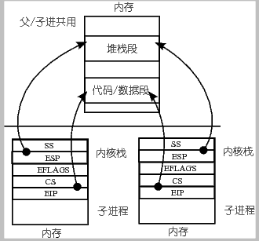
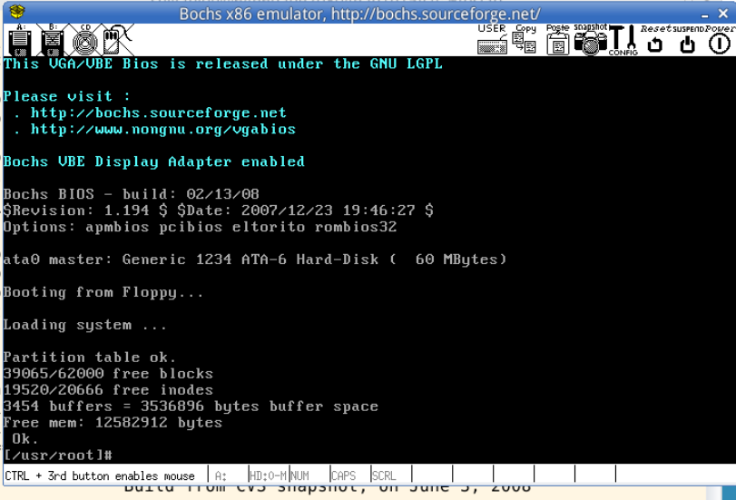
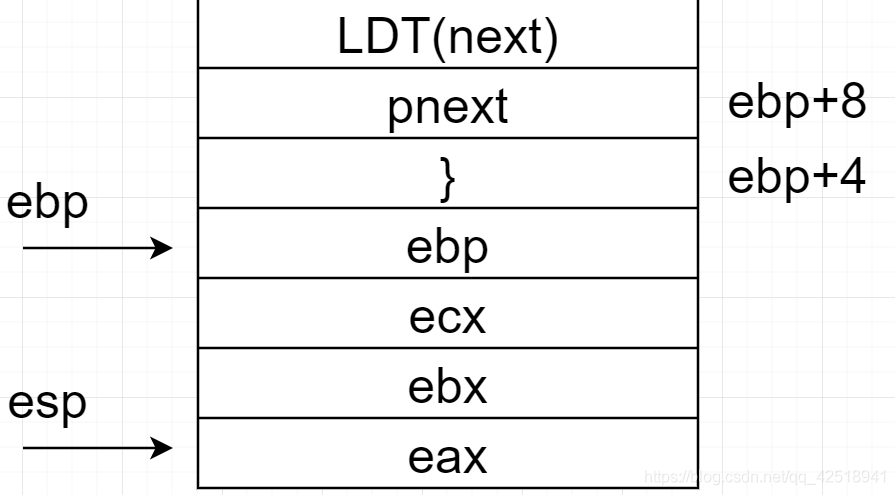
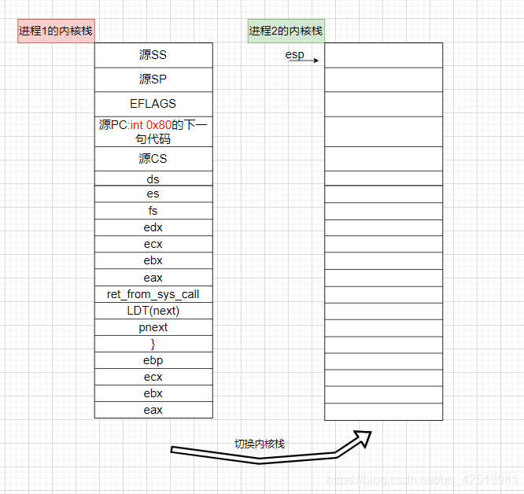

### Lab 4 基于内核栈切换的进程切换
- 将Linux 0.11中采用的TSS切换部分去掉，换成基于堆栈切换
  - 修改schedule
  - 重写switch_to，实现压栈、切换PCB、重写TSS指针、切换内核栈、切换LDT等任务
  - 修改copy_process，以实现进程切换时的内核栈切换


#### 4.1 修改schedule
在kernel/sched.c中
```c
//原schedule()函数如下
if ((*p)->state == TASK_RUNNING && (*p)->counter > c)
    c = (*p)->counter, next = i;

//......

switch_to(next);
//其中next为下一个进程对应的下标（在task[]数组中）
//下面为switch_to的实现代码，位于sched.h文件中
#define _TSS(n) ((((unsigned long) n)<<4)+(FIRST_TSS_ENTRY<<3))
......
#define switch_to(n) {\
struct {long a,b;} __tmp; \
__asm__("cmpl %%ecx,current\n\t" \  // 比较ecx（即task[n]）和current是否相等，以决定是否切换
	"je 1f\n\t" \ 
	"movw %%dx,%1\n\t" \  // 将dx(即_TSS(n))的值存入操作数%1(_tmp.b)
	"xchgl %%ecx,current\n\t" \ // 交换ecx和current（即任务切换）
	"ljmp *%0\n\t" \  // 见注释1
	"cmpl %%ecx,last_task_used_math\n\t" \
	"jne 1f\n\t" \
	"clts\n" \
	"1:" \
	::"m" (*&__tmp.a),"m" (*&__tmp.b), \
	"d" (_TSS(n)),"c" ((long) task[n])); \
}
```
现在我们不再使用TSS进行切换，因此传入switch_to的参数改为进程的PCB和LDT
```c
if ((*p)->state == TASK_RUNNING && (*p)->counter > c)
    c = (*p)->counter, next = i, pnext = *p;

//.......

switch_to(pnext, _LDT(next));
```

#### 4.2 修改switch_to
将原来位于include/linux/sched.h中的switch_to注释掉，在kernel/syscall.s中添加新的switch_to（原因？ “新的switch_to将作为一个系统调用函数”）
完整的switch_to代码已在实验指导书中给出，这里按顺序解释
```asm
// switch_to起始部分的代码，主要处理函数调用时栈的变化以及参数传递，执行过程中的栈变化参考注释2
switch_to:
  pushl %ebp      # 保存调用此函数的函数的栈帧基地址
  movl %esp, %ebp # 当前函数(switch_to)的栈帧基地址为栈顶地址
  pushl %ecx
  pushl %ebx
  pushl %eax      # 以上保存下面用到的几个寄存器
  movl 8(%ebp), %ebx      # 调用switch_to的第一个参数，即pnext——目标进程的PCB
  cmpl %ebx, current      # current为全局变量，指向当前进程的PCB
  je 1f           # 如果要切换到的进程就是目标进程，则不需要做任何操作 

  # 切换PCB
  movl %ebx, %eax
  xchgl %eax, current     # eax指向当前进程，ebx指向下一个进程，current指向下一个进程
  
// TSS中的内核栈基地址指针（esp）重写
// 虽然不再使用TSS进行任务切换了，但中断处理机制还是需要保持，所以所有进程共享一个TSS，任务切换时不再发生变化
// 为此，在sched.h中定义一个全局变量struct tss_struct *tss = &(init_task.task.tss);
  movl tss, %ecx  # tss为全局变量，指向当前进程的tss，以后所有进程都用这个tss
  addl $4096, %ebx  # 加上4096是因为如实验指导书所说，内核栈栈底位于PCB所在内存的高地址空间
  movl %ebx, ESP0(%ecx) # ESP0常量需要手动添加到system_call.s中。ESP0=4 见注释3
  
// 切换内核栈栈顶指针（切换当前的内核栈为目标内核栈）,即保存当前内核栈用到了哪个位置
  movl %esp, KERNEL_STACK(%eax)  # 保存当前进程内核栈栈顶指针到PCB中，注意，上面已经将eax指向了当前进程的PCB，KEENEL_STACK见注释4
  movl 8(%ebp), %ebx      # 注意，这里取出的是下一个进程的PCB地址
  movl KERNEL_STACK(%ebx), %esp  # 通过PCB地址可以获得之前保存的内核栈栈顶指针位置
  
// 切换LDT
  movl 12(%ebp), %ecx
  lldt %cx

// 切换LDT后  
// 这两句代码的含义是重新取一下段寄存器 fs 的值
  movl $0x17, %ecx
  mov %cx, %fs  # 目的是修改一下fs的值，会重新加载段寄存器的隐式部分
  cmpl %eax, last_task_used_math
  jne 1f
  clts
1:
  popl %eax  # 以下恢复函数开始时保存的寄存器，注意，这里已经切换到了另一个进程的内核栈，所以这些参数进程中开始的时候需要保存下来
  popl %ebx
  popl %ecx
  popl %ebp  # 恢复栈帧基地址
  ret
```

#### 4.3 修改fork.c
用户态的父子进程共用堆栈，数据段及代码段等内容；内核态子进程有自己的内核栈，进程切换也基于内核栈，因此copy_process需要适应进程切换的需要，修改内核栈的内容。
原有的copy_process可以明显看出是基于TSS的，参考，用内核栈重写如下
```c
    /* ...... */
    p = (struct task_struct *) get_free_page();
    /* ...... */
    p->pid = last_pid;
    p->father = current->pid;
    p->counter = p->priority;

    long *krnstack;
    krnstack = (long)(PAGE_SIZE +(long)p);
    //用户态与内核态切换的相关寄存器，寄存器相关详见注释5
    *(--krnstack) = ss & 0xffff;
    *(--krnstack) = esp;
    *(--krnstack) = eflags;
    *(--krnstack) = cs & 0xffff;
    *(--krnstack) = eip;

    // 拷贝父进程的寄存器
    *(--krnstack) = ds & 0xffff;
    *(--krnstack) = es & 0xffff;
    *(--krnstack) = fs & 0xffff;
    *(--krnstack) = gs & 0xffff;
    *(--krnstack) = esi;
    *(--krnstack) = edi;
    *(--krnstack) = edx;

    // 在switch_to中，切换进程后要弹出eax,ebx,ecx,edx，因此这里增加这四个寄存器以保持一致
    // 同理，这里的first_return_from_kernel也是为了对应switch_to中的ret指令
    *(--krnstack) = (long)first_return_from_kernel;
    *(--krnstack) = ebp;
    *(--krnstack) = ecx;
    *(--krnstack) = ebx;
    *(--krnstack) = 0;  // 子进程的fork执行成功后，fork函数的返回值为0
    p->kernelstack = krnstack;
    /* ...... */
```
写first_return_from_kernel
```c
// 上面已经给出了寄存器压栈的顺序，在返回用户态时按照相同的顺序执行即可
// 在system_call.s中定义
first_return_from_kernel:
  popl %edx
  popl %edi
  popl %esi
  pop %gs
  pop %fs
  pop %es
  pop %ds
  iret  # iret 从内核态返回用户态的指令
```

#### 4.4 总结需要修改的地方
这里放一个b站视频，这位up总结的很好，[Linux操作系统（哈工大李治军老师)实验楼实验4-内核栈切换的进程切换(4)](https://www.bilibili.com/video/BV1EL411J7Vc)
- system_call.s
switch_to和first_return_from_kernel的定义
ESP0和KERNEL_STACK的定义,修改硬编码
全局声明
```asm
.globl switch_to
.globl first_return_from_kernel
```
- kernel/fork.c
注释tss切换部分，改写为内核栈
添加外部函数声明
```c
extern void first_return_from_kernel(void);
```

- sched.h 
注释原switch_to的代码
在task_struct结构体中增加了long kernelstack，并修改INIT_TASK

- sched.c
在schedule()函数中增加PCB指针pnext，并在循环中赋值，最后修改switch_to的输入参数
```c
struct task_struct *tss =&(init_task.task.tss);
......
struct task_struct *pnext;
......
while (1) {
		c = -1;
		next = 0;
		pnext=task[next];
		i = NR_TASKS;
......
switch_to(pnext,_LDT(next));
```

#### 4.5 实验结果
将修改后的文件替换原linux 0.11中的文件，编译运行结果如下，系统可正常启动。用到的所有文件均在本md文件同目录下。


### 注释
#### 1. ljmp *%0
ljmp <segment-selector>:<offset>
参考实验指导书中的GDT示意图，0号进程的TSS表项在第4个位置上，即4<<3，相对于TSS在GDT表中开始的位置
TSS(n)是进程n的TSS位置，因此需要再加上n*16，因为每一个进程都对应一个TSS和LDT，长度均为8字节
所以 TSS(n)=n<<4+4<<3
在计算完TSS的位置后，将其放入tmp结构体32位长整数的前16位，现在64位的tmp结构体中前32为空，后32位中的后16位也为空
所以这句代码实际上就是 ljmp 0:n<<4+4<<3

#### 2. switch_to执行过程中的栈变化

完整的示意图参考 [CSDN](https://blog.csdn.net/qq_42518941/article/details/119182097)

内核栈切换示意图



#### 3. ESP0
在system_call.s中定义ESP0=4 原因如下
```c
// 在tss结构体中esp0变量正位于此处，这条语句用于完成tss结构体中esp0变量的重写
struct tss_struct {
	long	back_link;	/* 16 high bits zero */
	long	esp0;
  ......
```

#### 4. KERNEL_STACK
Linux 0.11的PCB定义中没有内核栈指针这一项（因为0.11使用TSS进行进程切换而非PCB），所以为了完成PCB的进程切换，需要在task_struct中增加KERNEL_STACK的定义
当然将 kernelstack 域加在 task_struct 中的哪个位置都可以，但是在某些汇编文件中（主要是在 kernal/system_call.s 中）有些关于操作这个结构一些汇编硬编码，所以一旦增加了 kernelstack，这些硬编码需要跟着修改，由于第一个位置，即 long state 出现的汇编硬编码很多，所以 kernelstack 千万不要放置在 task_struct 中的第一个位置
参考实验指导书，我们将KERNEL_STACK放在第四个位置
```c
// 在 include/linux/sched.h 中
struct task_struct {
    long state;
    long counter;
    long priority;
    long kernelstack;
//......
```
注意修改相关的汇编硬编码
```c
/* kernel/system_call.s */
ESP0        = 4
KERNEL_STACK    = 12
/* ...... */
state   = 0     # these are offsets into the task-struct.
counter = 4
priority = 8
kernelstack = 12
signal  = 16
sigaction = 20      # MUST be 16 (=len of sigaction)
blocked = (37*16)
```
当然，修改了PCB的结构后需要对PCB的初始化做对应的修改
```c
// 原init_task
#define INIT_TASK \
/* state etc */	{ 0,15,15, \
/* signals */	0,{{},},0, \
......
}

// 修改后 增加了内核栈指针的初始化
/* linux/sched.h */
#define INIT_TASK \
/* state etc */ { 0,15,15,PAGE_SIZE+(long)&init_task,\
/* signals */   0,{{},},0, \
......
}
```

#### 5. ss,esp,eflags,cs,eip
**ss (Stack Segment)**：`ss` 寄存器存储栈段的选择子，用于指示栈的内存段。栈是一种用于存储局部变量、函数调用信息和其他临时数据的数据结构。`ss` 寄存器的值决定了栈段在全局描述符表（GDT）或局部描述符表（LDT）中的位置。

**esp (Extended Stack Pointer)**：`esp` 寄存器存储栈指针的值，它指向栈的当前顶部。在函数调用时，参数、局部变量和其他数据都可以被压入栈中。通过调整 `esp` 的值，可以在栈上分配和释放数据。

**eflags (Flags Register)**：`eflags` 寄存器存储标志位，这些标志位用于表示处理器的状态和控制其操作。标志位包括进位标志、零标志、溢出标志、符号标志等。这些标志会影响算术、逻辑和其他操作的结果。

**cs (Code Segment)**：`cs` 寄存器存储代码段的选择子，用于指示代码的内存段。代码段是存储程序指令的区域。与 `ss` 寄存器类似，`cs` 寄存器的值决定了代码段在 GDT 或 LDT 中的位置。

**eip (Extended Instruction Pointer)**：`eip` 寄存器存储下一条要执行的指令的地址，也称为程序计数器（Program Counter）。当一条指令被执行后，`eip` 的值会自动递增，使其指向下一条指令。

**ds (Data Segment)**：`ds` 寄存器用于指定默认的数据段，它表示普通数据的存储区域。当执行数据操作（如加载数据到寄存器、从寄存器存储数据）时，数据将从 ds 指向的段中获取。

**es (Extra Segment)**：`es` 寄存器通常被用作附加数据段，用于一些特定操作。例如，字符串操作指令（如 movsb、movsw 等）可以使用 es 寄存器来指定目的地段。

**fs (Additional Segment)**：`fs` 寄存器也是一个附加数据段寄存器，用于更多的数据存储。在某些操作系统中，它可能用于存储线程局部数据或操作系统的特定数据。

**gs (Additional Segment)**：`gs` 寄存器同样是一个附加数据段寄存器，用于更多的数据存储。在一些操作系统中，它可能用于存储操作系统的全局数据。

**edx (Data Register)**：`edx` 寄存器通常用作通用数据寄存器。它在算术和逻辑运算中经常被用于存储操作数和结果。

**esi (Source Index)**：`esi` 寄存器常用作源数据的指针。在字符串操作、数据拷贝等操作中，`esi` 可以用于指向源数据的起始地址。

**edi (Destination Index)**：`edi` 寄存器通常用作目标数据的指针。在字符串操作、数据拷贝等操作中，`edi` 可以用于指向目标数据的起始地址。
