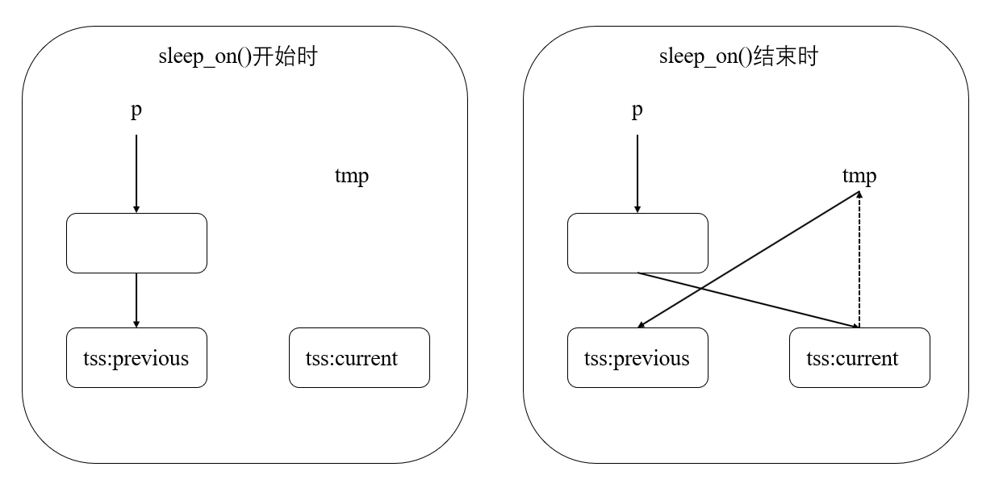

### Lab 5 信号量的实现和应用

- 在Ubuntu下编写程序，用信号量解决生产者消费者问题
  - 建立一个生产者进程，N个消费者进程
  - 用文件建立一个共享缓冲区
  - 生产者进程依次向缓冲区写入正数0-M(M>=500)
  - 消费者进程从缓冲区读数，每次读一个，并将读出的数字从缓冲区删除，然后将本进程ID和数字输出到标准输出
  - 缓冲区同时最多保存10个数
  - 
- 在0.11中实现信号量，并用生产者消费者程序检验

#### 5.1 生产者消费者问题
根据本实验的描述，这里需要三个信号量 Empty Full 和 Mutex
其中Empty描述共享缓冲区剩余空间，初始值为10；Full描述共享缓冲区已使用空间，初始值为0；Mutex描述缓冲区的使用情况，1表示未被占用。
与信号量相关的函数如下，具体见注释1
```c
// sem_t *sem_open(const char * name,unsigned int value);
// int sem_wait(sem_t *sem);
// int sem_post(sem_t *sem);
// int sem_unlink(const char * name);
// int sem_getvalue(sem_t *sem, int *sval)

// pc.c中创建信号量的部分如下
sem_unlink("/myEmpty"); // 避免其他程序在结束时未释放同名信号量造成的混乱
sem_unlink("/myFull");
sem_unlink("/myMutex");
sem_t* empty = sem_open("/myEmpty", O_CREAT, 0666, 10); // 创建myEmpty信号量
sem_t* full = sem_open("/myFull",O_CREAT, 0666,0);
sem_t* mutex = sem_open("/myMutex",O_CREAT, 0666,1);  //1是空闲，0是正在占用中
```
创建子进程分别作为生产者和消费者
```c
// Producer
// 生产者向文件的末尾写入数字
for(i=0;i<50;i++){
  sem_wait(empty);
  sem_wait(mutex);

  printf("Processor is writing %d.\n",i);
  lseek(fd,0,SEEK_END);  // lseek函数移动文件指针，参考注释2
  write(fd,&i,sizeof(int));  // 向文件指针所在位置（文件末尾），写入数字

  sem_post(mutex);
  sem_post(full);
}
```

```c
// Consumer
// 多个消费者从文件中读取数字，并删除已读取的数字
for(j=0;j<10;j++){
  sem_wait(full);
  sem_wait(mutex);

  lseek(fd,0,SEEK_SET);
  read(fd,&tmp,sizeof(int));
  printf("Consumer %d reading : %d.\n",getpid(),tmp);
  int file_len=lseek(fd,0,SEEK_END);
  int k;
  for(k=1;k<(file_len/sizeof(int));k++){  // 这里需要将文件中的数字从后向前搬移一位
      lseek(fd,k*sizeof(int),SEEK_SET);
      read(fd,&tmp,sizeof(int));
      lseek(fd,(k-1)*sizeof(int),SEEK_SET);
      write(fd,&tmp,sizeof(int));
  }
  ftruncate(fd, file_len - sizeof(int));  // 在读取并搬移完毕后重新调整文件的大小

  sem_post(mutex);
  sem_post(empty);
}
```

将完成的pc.c文件导入实验环境，编译运行以验证其正确性，得到如下图所示结果

注意：pthread并非Linux系统的默认库，编译时需要加上-lpthread参数
gcc -o pc pc.c -lpthread
ps. debug的时候遇到的一点小问题，c程序执行完后需要按一下回车键才能结束，后来发现是等子进程结束出错了。wait只能等一个子进程，需要用waitpid实现等待所有子进程结束。

#### 5.2 在Linux 0.11中实现信号量
Linux 0.11中并没有信号量，而是采用互斥锁管理多个进程访问共享的内核数据
二者的区别见注释3
在linux 0.11中增加信号量的定义和相应的函数
首先，按照实验指导书的提示，学习Linux 0.11中给出的函数 kernel/blk_drv/ll_rw_blk.c
```c
static inline void lock_buffer(struct buffer_head * bh)
{
    // 关中断,通过关闭中断避免进程切换，实现原子操作
    cli();

    // 将当前进程睡眠在 bh->b_wait
    while (bh->b_lock)
        sleep_on(&bh->b_wait);  // 通过sleep_on和wake_on实现进程等待和切换
    bh->b_lock=1;
    // 开中断
    sti();
}

static inline void unlock_buffer(struct buffer_head * bh)
{
    if (!bh->b_lock)
        printk("ll_rw_block.c: buffer not locked\n\r");
    bh->b_lock = 0;

    // 唤醒睡眠在 bh->b_wait 上的进程
    wake_up(&bh->b_wait);
}
```
sleep_on函数实现了将当前进程的PCB放入互斥锁（也可以是信号量）的wait_queue队首，实现了一个相当巧妙的队列，具体可以看注释4
参考上面的实现，开始为Linux 0.11增加信号量的实现
首先是sem_t的定义,位于./include/linux/sem.h中
```c
typedef struct semaphore
{
    char name[SEM_NAME_LEN];    /* 信号量名称 */
    int value;                  /* 信号量值 */
    struct task_struct *queue;  /* 信号量等待队列 */
} sem_t;
 
/* sem_t结构体中包含三个成员
   name: 信号量的名称
   value: 信号量的取值
   queue: 在此信号量上等待的所有进程的PCB队列 
*/
```
接着实现信号量的相关操作，在./kernel/sem.c中

#### 5.3 在Linux 0.11中运行pc.c
首先对原pc.c做一些修改，修改头文件并添加系统调用声明
```c
#define __LIBRARY__
#include <unistd.h>
#include <linux/sem.h>
#include <stdio.h>
#include <sys/types.h>
#include <sys/stat.h>
#include <fcntl.h>
#include <linux/sched.h>

_syscall2(sem_t *,sem_open,const char *,name,unsigned int,value)
_syscall1(int,sem_wait,sem_t *,sem)
_syscall1(int,sem_post,sem_t *,sem)
_syscall1(int,sem_unlink,const char *,name)
```

然后回顾lab2中添加系统调用的过程，在Linux 0.11中添加sem_open,sem_wait,sem_post和sem_unlink四个系统调用，并将pc_linux.c挂载到Linux 0.11上。

ps.为什么我这里pc.c和pc_linux.c差别这么大，因为原来的pc.c在ubuntu下能正常执行，但是挂载到Linux 0.11中就不能正常结束进程，这个问题一直解决不了，所以参考 https://blog.csdn.net/Amentos/article/details/131002529 又另写了一份。

### 注释
#### 1.信号量操作函数
```c
sem_t *sem_open(const char * name,int oflag, mode_t mode,unsigned int value);
int sem_wait(sem_t *sem);
int sem_post(sem_t *sem);
int sem_unlink(const char * name);
```
sem_open()创建一个信号量，或打开一个已经存在的信号量
- sem_t是信号量类型
- name是信号量名字
- oflag表示信号量的行为，常设为O_CREAT指创建信号量
- mode指信号量的权限，常用值为0666
- value是信号量的初值，仅当新建信号量时该参数有效

sem_wait()信号量的P操作
sem_post()信号量的V操作
sem_unlink()删除信号量

#### 2.文件操作函数
off_t lseek(int fd, off_t offset, int whence);
移动文件指针，用于修改读写数据的位置
- fd 文件描述符
- offset 相对于第三个参数whence的偏移量
- whence 起始位置，SEEK_SET表示文件开头，SEEK_CUR表示当前位置，SEEK_END表示文件末尾

int ftruncate(int fd, off_t length);
调整文件大小
- fd 文件描述符
- length 目标文件大小，将文件裁剪为该大小


#### 3.信号量与互斥锁
从这两个词的英文能看出来它们的区别，信号量是semaphore，互斥锁是mutex exclusion
根据我们在5.1中写的代码可以得知，mutex是semaphore的一种形式，mutex用于控制进程占用某个资源，其他进程不能使用，而semaphore则更包含了对资源的管理，告诉进程这一块共享资源的使用信息。

#### 4.sleep_on()解析
sleep_on函数的解析非常推荐去看李治军老师的MOOC讲解 https://www.icourse163.org/learn/HIT-1002531008?tid=1450346461#/learn/content?type=detail&id=1214728551 从大约10min开始。建议在做实验的时候回顾这一部分。

如上图所示，sleep_on开始时，二重指针p指向的是原wait_queue的队首PCB；而在sleep_on结束时，p指向current进程对应的PCB，tmp指向原队列的队首。那么在这种情况下，current就作为wait_queue的新队首。
同时，由于tmp是current进程执行过程中的临时变量，所以tmp位于current进程内核栈中，如图中的虚线所示，根据current的PCB可以找到对应的tmp。而tmp指向previous的PCB，这样就形成了队列的结果，每次执行sleep_on时更换队首PCB。

