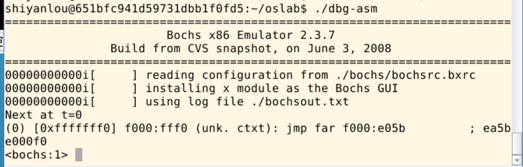

### Lab 6 地址映射与共享

- 跟踪地址翻译过程
  - 在Linux 0.11中通过test.c跟踪逻辑地址、LDT表、GDT表等信息
- 基于共享内存的生产者-消费者程序
  - 使用共享内存实现生产者-消费者程序，且二者作为不同的程序
- 共享内存的实现
  - 在Linux 0.11中增加shmget()和shmat()两个系统调用，以支持生产者-消费者程序的运行

#### 6.1 地址翻译跟踪
首先编写一个无限循环文件test.c，并拷贝到linux 0.11系统中
输入命令 ./dbg-asm 开始调试
此时，Bochs界面是黑屏状态，终端显示暂停在第一条指令上

在终端输入c指令，正常启动Linux系统，在Linux 0.11上编译运行test.c
可以看到程序正在无限循环，在终端命令行暂停Bochs（Ctrl+c）开始调试

这里我们需要停在while循环的判断语句，如果不是cmp指令的话再单步运行几次停在这里

```c
cmp dword ptr ds:0x3004,0x00000000;
/*
  dword:数据类型，双字（32bit）
  ptr ds:0x3004 :表示该数据存放的地址，ds是段寄存器，0x3004是段偏移
*/
```
现在需要根据ds的值来确定变量i的逻辑地址，就需要先查找GDT和LDT的信息
- 查看GDT，并由此得到该程序的LDT
输入sreg命令，显示出各寄存器的值，其中gdtr代表GDT的地址，ldtr代表当前程序LDT在GDT中的位置

这里可以看到gdtr的值为0x00005cb8,ldtr的值为0x0068，根据ldtr的结构可以知道LDT的索引为1101

所以LDT的地址为 0x00005cb8+13\*8
这里我们验证一下上面的计算，输入xp /2w 0x00005cb8+13*8得到下面的结果，与sreg中的输出一致

那么LDT的地址就是 0x00fd52d0，取dh的31-24bit，7-0bit，dl的31-16bit拼接而成

- 根据LDT和段选择子ds得到段描述符
同样的，sreg命令给出了ds的值为0x0017，那么段描述符的索引就是0x10，所以LDT的第三项就是段描述符（8字节）

0x00fd52d0+2\*64
具体而言，下图中红框里面就是段描述符，与sreg中ds后面的dl与dh也一致


- 根据段描述符计算逻辑地址
根据上面的段描述符以及最开始的偏移地址0x3004可得逻辑地址为
0x10000000+0x3004=0x10003004
使用 calc ds:0x3004 可以验证此结果

上面描述了程序端的视角，从GDT，LDT和段寄存器得到变量i的逻辑地址
对于计算机操作系统而言，逻辑地址与物理地址间的映射通过分页机制实现


我们上面计算的逻辑地址按照页表映射可以分为页目录号（1000000），页表号（0000000011），页内偏移（000000000100）
首先，使用creg命令查看页目录表的位置，CR3=0x00000000

页目录表中的每一个表项都是32位，因此我们需要查看的表项为0+64\*4。如下图所示，对应的页表项为0x00fa6027。
页表项的31bit-12bit为物理页码，所有这里的物理页码为0x00fa6，从该页码开始查找第三项的值(m每项均为4字节) xp /w 0x00fa6000+3\*4
得到最终的物理地址为 0x00fa3000+0x004 = 0x00fa3004

验证方法如上图中所示，使用 page 0x10003004 或者直接查询物理地址处的值 xp /w 0x00faa3004

#### 6.2 实现共享内存
实现内存共享需要两个函数
```c
int shmget(key_t key, size_t size, int shmflg);
/*
  key: 共享内存标识符
  size: 共享内存大小
  shmflg: 标志位，用于指定共享内存的创建和访问权限
  返回值: 创建成功时返回标识符，失败时返回-1
*/
void *shmat(int shmid, const void* shmaddr,int shmflg);
/*
  shmid: 共享内存段的标识符
  shmaddr: 要连接的共享内存段的首地址，通常置为NULL，由系统选择
  shmflg: 标志位
  返回值: 成功时返回一个指向共享内存段的指针，失败时返回ERRNO
*/
```
在shm.h中完成上述函数的声明
```c
#include <stddef.h>     
 
typedef unsigned int key_t;
 
struct struct_shmem
{
    unsigned int size;  // 共享内存大小
    unsigned int key;   // 共享内存id
    unsigned long page; // 共享内存地址
};
 
int shmget(key_t key, size_t size); // 这里的函数简化了
void* shmat(int shmid);
 
#define SHM_NUM  16 
```

在shm.c中实现上述函数，这里只截取部分
```c
struct struct_shmem shm_list[SHM_NUM]={{0,0,0}};
int sys_shmget(key_t key, size_t size)
{
  page=get_free_page(); // 申请一个空闲物理页面
  ......
  for(i = 0; i < SHM_NUM; i++)  // 将申请好的页面放入结构体中记录
    {
        if(shm_list[i].key == 0)
        {
            shm_list[i].size = size;
            shm_list[i].key = key;
            shm_list[i].page = page;
            break;
        }
    }
}

void* sys_shmat(int shmid)
{
  ......
  tmp = get_base(current->ldt[1]) + current->brk;  //计算虚拟地址
  put_page(shm_list[shmid].page,tmp);
  logicalAddr = current->brk;  //记录逻辑地址
  current->brk += PAGE_SIZE;  //更新brk指针
  return (void *)logicalAddr;
}
```

编写完成后将shm.c和shm.h放入linux 0.11中的相应位置，按照Lab2中类似的过程，修改Makefile，unistd.h等文件重新编译系统即可。

**注意：本次实验需要调用信号量相关函数，因此需要保留Lab 5中关于信号量的系统调用**

#### 6.3 producer.c和consumer.c的编写
将Lab 5中的程序修改为两个程序，并将读写文件的部分修改为读写共享内存即可
具体实现见consumer.c和producer.c
将程序挂载到Linux 0.11下编译运行，得到如下实验结果


### 注释
#### 1. Linux 0.11中的内存相关函数
```c
extern unsigned long get_free_page(void);
/*
  位于mm/memory.c中
  功能：从物理内存池中分出一块内存
*/
#define get_base(ldt) _get_base( ((char *)&(ldt)) )
/*
  位于include/linux/sched.h
  功能：从addr处取段基地址
  注意到，在Linux 0.11中数据段和代码段的基址是相等的，即数据段和代码段共享同一地址空间
  所以，get_base(current->ldt[1])是取数据段和代码段的共同基址
  这一句代码也可在fs/exec.c的change_ldt函数中找到原型
*/
unsigned long put_page(unsigned long page,unsigned long address)
/*
  位于mm/memory.c中
  功能：建立逻辑地址和物理地址间的映射
  page: 物理地址
  address: 逻辑地址
*/
```

#### 2. current中的相关值
在shmat函数计算逻辑地址的过程中，可以看到这样一句话
tmp = get_base(current->ldt[1]) + current->brk;
这里涉及到current的内容，简单解释如下
```c
// 在 sched.h目录下有task_struct的定义，在Lab 4里已经见过了
// 截取部分如下
/* ldt for this task 0 - zero 1 - cs 2 - ds&ss */
	struct desc_struct ldt[3];
// 上面定义的ldt中有3个描述符，索引0为空描述符，索引1指向代码段，索引2指向数据段和栈段
// 所以上面的get_base(current->ldt[1])取的是代码段地址
  unsigned long ......,brk,start_stack;
// current->brk表示进程当前堆的位置
// 分配的新页面在此地址上增长
```