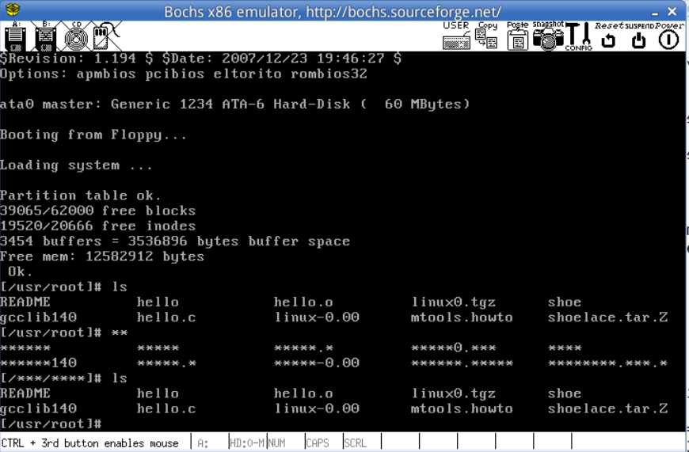

### Lab 7 终端设备的控制

- 修改Linux 0.11的终端设备处理代码，通过键盘输入控制字符显示
  - 用户按一次F12后，终端输出的所有字母都替换为“*”，再按一次F12后恢复正常


#### 7.1添加F12键盘处理
- 修改kernel/chr_drv/tty_io.c文件 （注释1，tty）
tty_io.c包括字符设备的上层接口函数，主要含有终端读/写函数tty_read()和tty_write()，这里把F12的状态控制函数添加到此文件的末尾
```c
int f12_flag=0;
void press_f12(){
    if(f12_flag==0) f12_flag=1;
    else f12_flag=0;
}
```

- 修改include/linux/tty.h文件
在文件末尾添加上面变量及函数的定义
```c
extern int f12_flag;
void press_f12();
```

- 修改kernel/chr_drv/keyboard.S文件，将f12的功能函数修改为press_f12
```c
.long press_f12,none,none,none
```

#### 7.2 修改con_write,控制终端输出
修改kernel/chr_drv/console.c中的con_write函数
```c
// 这里截取其中的一部分
while (nr--) {
		GETCH(tty->write_q,c); //从缓冲队列中取一个字符并处理
		switch(state) { 
            // state表示该字符的类型，根据类型做出对应的处理，state=0表示该字符不是控制字符，也不是扩展字符
            // 这里我们只需要修改state=0的情况
			case 0:
				if (c>31 && c<127) {
					if (x>=video_num_columns) {
						x -= video_num_columns;
						pos -= video_size_row;
						lf();
					}
                /* 修改开始 */
                if(f12_flag==1){
                    if((c>='A'&&c<='Z'>)&&(c>='a'&&c<='z'>))
                        c='*';
                }
                /* 修改结束 */
					__asm__("movb attr,%%ah\n\t"
						"movw %%ax,%1\n\t"
						::"a" (c),"m" (*(short *)pos)
						);
					pos += 2;
					x++;
				}
```
#### 7.3 编译运行
在完成修改后，重新编译运行，得到如下实验结果



### 注释
#### 注释1 tty
tty 是一个缩写，代表 teletypewriter，最初是用来表示电传打字机（teletypewriter）的设备。在计算机领域，特别是在类Unix系统中，tty表示终端（terminal）或终端设备。