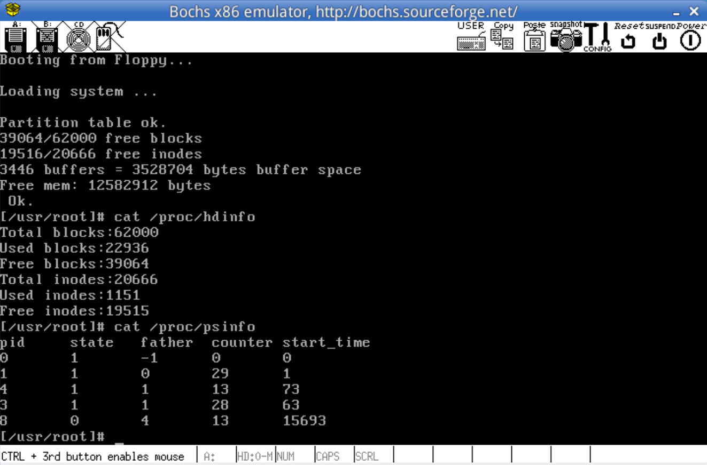

### Lab 8 proc文件系统的实现

- 在Linux 0.11上实现procfs（proc文件系统）内的psinfo结点，当读取此结点的内容时，可得到系统当前所有进程的状态信息
- psinfo,hdinfo,inodeinfo均可准确读取显示


#### 8.1 增加文件类型
在Linux 0.11已有的文件系统上增加对proc文件的兼容
在 include/sys/stat.h 中增加相应的文件类型以及宏
```c
/* 增加proc文件类型以及相应的宏 */

#define S_IFPROC 0030000

#define S_ISPROC(m) (((m) & S_IFMT) == S_IFPROC)

/* 修改完成 */
```
注意，为与S_IFMT相匹配，S_ISPROC后四位应为0

#### 8.2 让mknod支持新的文件类型
```c
// fs/namei.c
/* 修改前
// 设置节点的属性模式，如果要创建的是块设备文件或者是字符设备文件，则i节点的直接块指针0等于设备号
	if (S_ISBLK(mode) || S_ISCHR(mode))
		inode->i_zone[0] = dev;
	inode->i_mtime = inode->i_atime = CURRENT_TIME;
	inode->i_dirt = 1;
*/
// 对于proc文件，也采用相同块设备文件和字符设备文件的相同方式
if (S_ISBLK(mode) || S_ISCHR(mode) || S_ISPROC(mode))
     inode->i_zone[0] = dev;

inode->i_mtime = inode->i_atime = CURRENT_TIME;
inode->i_dirt = 1;
// 在目录中增加新的一项
bh = add_entry(dir,basename,namelen,&de);
```

#### 8.3 初始化proc文件系统
注意到proc文件系统作为文件系统的一部分，应该在根文件系统挂载后初始化
这里需要使用系统调用mkdir和mknod，而系统初始化在执行到init时已经进入用户态了，因此需要在main.c的开头增加两个调用
```c
/* 增加调用接口 */
_syscall2(int,mkdir,const char*,name,mode_t,mode)
_syscall3(int,mknod,const char*,filename,mode_t,mode,dev_t,dev)
```
在init中，创建/proc目录并初始化相应的文件
```c
setup((void *) &drive_info);
	(void) open("/dev/tty0",O_RDWR,0);
	(void) dup(0);
	(void) dup(0);

    /* 挂载根系统后，再初始化proc文件系统 */
    // 见注释2
    mkdir("/proc",0755);
    mknod("/proc/psinfo",S_IFPROC|0444,0);
    mknod("/proc/hdinfo",S_IFPROC|0444,1);
    mknod("/proc/inodeinfo",S_IFPROC|0444,2);
    /* 修改结束 */
```

#### 8.4 修改read_write.c文件
在上面创建好/proc文件后，这里编写读写/proc文件内容的部分
```c
// 在sys_read()中增加一个用于处理proc文件的分支
/*  处理函数所需的参数包括
    inode->i_zone[0]:mknod时指定的设备编号，根据该编号采取不同的读取方式
    buf:用户空间，用于接收数据
    count:说明buf的大小
    &file->f_pos:f_pos是上一次读文件结束时文件位置指针的指向
*/
if(S_ISPROC(inode->i_mode))
        return proc_read(inode->i_zone[0],&file->f_pos,buf,count);

// 同时在该文件的开始增加外部函数proc_read的声明语句
extern int proc_read(int dev,char* buf,int count,unsigned long* pos);
```

#### 8.5 完成proc.c文件并修改Makefile
在proc.c中完成对proc文件的操作，以psinfo为例
```c
// 主函数
// proc_read根据设备编号，把不同的内容写入到用户空间的buf
// 首先根据不同的设备号，将相应的信息写入proc_buf缓冲区
// 再将proc_buf中的内容拷贝到用户态buf
int proc_read(int dev, unsigned long * pos, char * buf, int count)
{
	
 	int i;
	if(*pos % 1024 == 0)
	{
		if(dev == 0)
			get_psinfo();
		if(dev == 1)
			get_hdinfo();
		if(dev == 2)
			get_inodeinfo();
	}
 	for(i=0;i<count;i++)
 	{
 		if(proc_buf[i+ *pos ] == '\0')  
          break; 
 		put_fs_byte(proc_buf[i+ *pos],buf + i+ *pos);
 	}
 	*pos += i;
 	return i;
}
```

在完成修改后，将proc.c文件加入Makefile中
```c
OBJS= ... proc.c
......
### Dependencies:
proc.o: proc.c ../include/linux/kernel.h ../include/linux/sched.h \
 ../include/linux/head.h ../include/linux/fs.h ../include/sys/types.h \
 ../include/linux/mm.h ../include/signal.h ../include/asm/segment.h
```

最终编译运行，得到如下结果



### 注释
#### 1. inode与file
```c
struct m_inode {
	unsigned short i_mode;  // 文件类型和属性（rwx位）
	unsigned short i_uid;   // 用户id（文件所有者）
	unsigned long i_size;   // 文件大小
	unsigned long i_mtime;  // 修改时间
	unsigned char i_gid;    // 组id（文件拥有者所在组）
	unsigned char i_nlinks; // 文件目录链接数（一个目录包含的子目录数，包括子目录和文件）
	unsigned short i_zone[9];   // 直接（0-6），间接（7）或双重间接（8）逻辑块号
/* these are in memory also */
	struct task_struct * i_wait;    // 下面的内容不再赘述，《完全注释》中可以查到
	unsigned long i_atime;
	unsigned long i_ctime;
	unsigned short i_dev;
	unsigned short i_num;
	unsigned short i_count;
	unsigned char i_lock;
	unsigned char i_dirt;
	unsigned char i_pipe;
	unsigned char i_mount;
	unsigned char i_seek;
	unsigned char i_update;
};

// 每打开一个文件就会创建一个file结构体，每个结构体都会指向一个inode
struct file {
	unsigned short f_mode;
	unsigned short f_flags;
	unsigned short f_count; // 对应文件句柄的引用计数
	struct m_inode * f_inode;   // 该结构体对应的inode节点
	off_t f_pos;    // 文件位置（读写偏移值）
};
```

#### 2. mkdir和mknod
```c
// 这里的mode由文件类型和文件权限两部分组成，S_IFPROC|0444就是一种表现形式
// mknod()的第三个参数dev用来说明结点所代表的设备编号。对于procfs来说，此编号可以完全自定义。proc文件的处理函数将通过这个编号决定对应文件包含的信息是什么。例如，可以把0对应psinfo，1对应hdinfo，2对应inodeinfo。
int sys_mkdir(const char * pathname, int mode)
int sys_mknod(const char * filename, int mode, int dev)
```

#### 3. put_fs_byte
```c
static inline void put_fs_byte(char val,char *addr)
{
__asm__ ("movb %0,%%fs:%1"::"r" (val),"m" (*addr));
}
```
